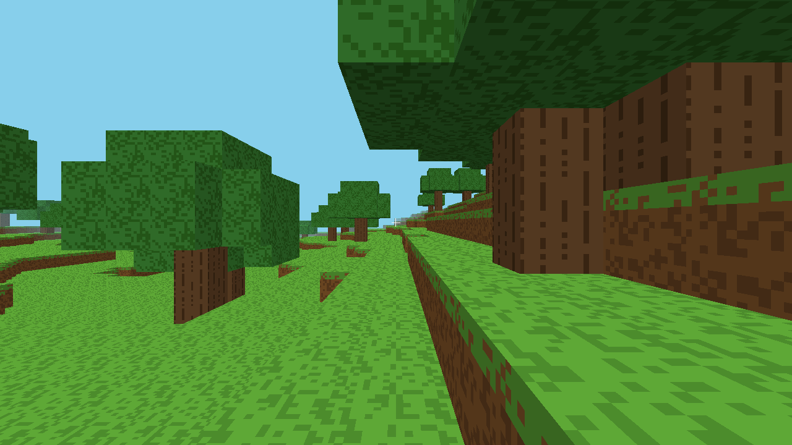

# 3D Minecraft Clone

A survival voxel game written in Java on top of [LWJGL 3](https://www.lwjgl.org/) (GLFW + modern OpenGL) — closer to a "survival craft" than to vanilla Minecraft's creative-friendly loop: you gather everything by hand, hunger and lava and falling and drowning can all kill you, and the day/night cycle actually matters. Fully self-contained — no assets to download at runtime. Block textures are generated procedurally into one shared atlas at startup (so chunk meshing can batch many blocks into a single draw call); each inventory-only item (tools, food) instead has its own individual 16×16 PNG committed in the repo under `src/main/resources/items/`, produced once by a small offline generator tool - see [Textures](#textures) below.



## Features

- **Survival stats**: health, hunger and stamina, all visible as HUD bars. Falling too far, standing in lava, staying underwater too long past your breath limit, and letting hunger hit zero all deal real damage; health quietly regenerates on its own once you're well-fed. Sprinting costs stamina (and a little extra hunger) and locks out until it recovers. Death scatters your inventory on the ground and respawns you at world spawn.
- **Tools & mining**: breaking is hold-to-break, not instant - how long depends on the block's hardness and whatever tool you're holding. Wood/stone/iron/diamond pickaxes, axes and swords (crafted from raw materials + sticks) each mine faster than the tier below at their specialty, and some blocks (ores, in increasing order of rarity) flatly require a minimum tool tier - you can't punch out a diamond. Tools wear out with use (higher tiers last much longer) and show a HUD wear bar once damaged. Swords are quickest through leaves and cacti; combat is on the roadmap once there's something to fight. The block outline glows redder and thickens as you get closer to breaking it.
- **Foraging**: apples occasionally drop from broken leaves, and rare berry bushes dotted across grassy biomes yield berries when harvested. Select a food item and right-click to eat it and restore hunger — the same button placing blocks uses, since the game treats "use the selected item" as one contextual action.
- **A day/night cycle**: a 10-minute real-time cycle dims the world and shifts the sky toward dark blue at night, driven by a global ambient-brightness uniform in the chunk shader — darkness is a real, visible signal, not just cosmetic.
- **Torches**: a real (if simplified) local light source, craftable from a stick + coal. Placed like any other block, a torch keeps the blocks around it lit at a brightness floor that doesn't dim at night, fading out smoothly with distance - see [Notes & Simplifications](#notes--simplifications) for how this differs from true light propagation.
- **Lamps**: a brighter, full-cube light source for lighting a whole room without a forest of torch sticks. A lamp is a solid block with the maximum light level (15, vs a torch's 8), so it pushes back the darkness further and looks like a glowing lit panel. Crafted from a glass block + a torch, placed and broken like any other block.
- **Crafting (Minecraft-style)**: a 3×3 crafting grid on the inventory screen - press `E`, click ingredients into the grid, and the output slot shows the result; click it to craft (the result lands on the mouse cursor). **Shaped** recipes match anywhere in the grid and are mirrored (so an axe works with its handle on either side): a log → 4 planks, 2 planks stacked → 4 sticks, a stone ring → furnace, coal over a stick → 4 torches, glass over a torch → lamp, 3 across → 6 slabs, and the pickaxe/axe/sword shapes in wood/stone/iron/diamond. **Shapeless** recipes ignore arrangement and match on the ingredient combination instead - currently 2 sand (anywhere) → 1 glass. Adding a recipe is a one-liner in `Crafting.java` (see its javadoc).
- **Furnace & smelting**: a placeable furnace block (8 stone) that smelts raw ore into the refined ingots/gems iron and diamond tools require. Aim at a placed furnace and press `C` with ore selected to smelt it (one coal per smelt). See [Furnaces & smelting](#furnaces--smelting).
- **Infinite, persistent voxel world**: chunks (16×128×16) generate on demand from the seed as you explore in any direction with no boundary, streamed in/out around the player and loaded/meshed incrementally so the game never freezes. Memory stays bounded to render distance — only chunks you've actually edited are written to disk, and reloading one restores your edits instead of regenerating pristine terrain, even across a restart.
- **Procedural terrain generation**: layered Perlin/fBm noise for rolling hills and mountains, a second noise channel for rough biomes (desert / plains / forest / snowy peaks), winding rivers carved from a dedicated noise channel, 3D-noise cave systems with lava pooling in the deepest pockets, and four depth-gated ore veins (coal, iron, gold, diamond - rarer ones deeper and sparser, mirroring vanilla Minecraft's progression).
- **Biome-varied vegetation**: dense oak forests where it's wet, sparser oak on plains, conical pine trees at higher/colder elevations, cacti in deserts, and tall grass/flowers/berry bushes scattered across grassy ground.
- **Fast chunk meshing**: per-block face culling (only exposed faces are emitted) with baked fixed-direction shading (top/side/bottom), distance fog, and cross-shaped "billboard" geometry for non-cube decoration (grass/flowers/bushes) with alpha-cutout transparency.
- **First-person player controller**: WASD walking with gravity and AABB-vs-voxel collision resolved per axis, jumping, stamina-gated sprinting, and a creative-only flight mode (`F` to toggle).
- **Block interaction**: raycast-based block breaking/placing (reach limited to 6 blocks) with a wireframe outline on the targeted block, gated by a real inventory - breaking a block drops it as an item to pick up, placing spends one, and bedrock is unbreakable. Starts empty, so you gather before you build.
- **Flowing fluids**: place a **water source** or **lava source** and it flows like Minecraft - it pours straight down until it lands, then spreads out (water 7 blocks, lava 3) and dries up when the source is removed. Flowing lava burns, flowing water drowns. Oceans/cave lava are static fills that don't move.
- **Item drops**: broken blocks drop their item into the world as a small bobbing sprite that falls with gravity and rests on the ground; walk over it to pick it up (items despawn after 5 minutes). Dying scatters your whole inventory around you the same way.
- **Inventory & hotbar (Minecraft-style)**: a 36-slot inventory - 9 hotbar slots plus a 3×9 grid - where items stack up to 64 (tools are unstackable). Press `E` to open it and move items with the mouse: left-click picks up/places a whole stack, right-click does one item, shift-click quick-moves a stack between the hotbar and inventory, and drag spreads a stack across slots. Hovering any item shows a Minecraft-style tooltip with its name (and durability for tools). The in-game hotbar shows the first 9 slots (`1`-`9` / scroll to select). **Creative mode** gets its own inventory screen instead: a tabbed item catalog (Building / Decoration / Materials / Tools / Combat / Food) over the hotbar, where clicking an item puts a full stack on your cursor (shift-click moves it straight into a hotbar slot) and an "X" slot deletes whatever the cursor holds.
- **Game modes** (settings menu): **Survival** (the default), **Creative** (instant break, place blocks for free, flight, no damage or hunger, plus a tabbed creative inventory), **Adventure** (no breaking or placing, still vulnerable), and **Spectator** (no-clip flight through the world, no interaction or damage).
- **Slabs (partial-cube blocks)**: stone and planks slabs, the first half-height blocks. A slab occupies only the lower half of its cell - meshed with a top face at half height and a half-height collision box (you can step onto one without jumping), and its block-selection outline shrinks to match. The mesher treats slabs as non-occluding, so full blocks beside/above them render correctly; this is the first piece of the partial-cube support that stairs/doors/fences will build on.
- **On-screen HUD**: a 9-slot hotbar with block icons batched from the game's shared texture atlas and item icons (food/tools) drawn from their own individual PNGs, live stack counts drawn with a tiny procedural pixel font (its own small atlas, no external font/text-rendering library), a highlight border on the selected slot, health/hunger/stamina bars above it, transient on-screen messages (death, crafting, tool breakage), an `F3`-toggled debug overlay (FPS, position, selected item), and a full mouse-driven inventory screen (see Inventory & hotbar).
- **Settings menu**: `Esc` pauses the game and opens an in-game settings menu (arrows/WASD to move the highlight, `Enter`/`Space`/`Left`/`Right` to change a setting, `Esc` to close). Graphics options:
  - **See-through leaves**: with it on, leaves use an alpha-cutout texture with holes punched through them and stop occluding faces behind them, so you can actually see through a tree canopy (the classic "fast leaves" look); off, they're the default opaque cubes. Toggling it live-rebuilds loaded chunk meshes, so the change streams in while you're looking at it.
  - **Render distance** (3-12): chunk streaming radius, so fewer blocks to draw for speed or more view for looks.
  - **VSync**: cap the framerate to the monitor's refresh or uncap it.
  - **Field of view** (60-110): camera zoom.
  - **Mouse sensitivity** (0.03-0.40): mouse-look speed.
  - **Game mode** (Survival / Creative / Adventure / Spectator): the four Minecraft modes - see Game modes below.
  - All of these apply immediately, while the menu is open.
- **Procedural block texture atlas**: grass, dirt, stone, sand, water, wood/planks, leaves, bedrock, snow, gravel, cactus, lava, glass, four ores, berry bushes, torches, lamps, and alpha-cutout grass/flower tiles, all generated at runtime into one shared sheet.

## Requirements

- JDK 17+ (only to run a pre-built jar; also need Maven 3.6+ to build from source)
- A GPU with OpenGL 3.3 support (or a software rasterizer like Mesa `llvmpipe`)

## Getting a jar

Every [GitHub Release](../../releases) has `minecraft-clone.jar` attached as a build artifact - just download it and run:

```bash
java -jar minecraft-clone.jar
```

That jar is built automatically by [`.github/workflows/release.yml`](.github/workflows/release.yml) whenever a release is published, so there's no manual packaging step to keep in sync.

## Building & Running from source

```bash
mvn compile exec:java
```

or build a runnable fat jar yourself:

```bash
mvn package
java -jar target/minecraft-clone.jar
```

The packaged jar bundles LWJGL natives for Linux, Windows and macOS (Intel + Apple Silicon), so the one build works on any of them out of the box — just run `java -jar target/minecraft-clone.jar` (JDK 17+ required) wherever you copy it.

## Controls

| Input | Action |
|---|---|
| `W A S D` | Move |
| Mouse | Look around |
| `Space` | Jump (or fly up, in flight mode) |
| `Left Shift` | Fly down (flight mode only) || `Left Ctrl` | Sprint (costs stamina) |
| `F` | Toggle flight (creative only) |
| Hold Left click | Mine the targeted block (speed/possibility depends on your tool) |
| Right click | Place the selected block - or eat it, if it's food |
| `E` | Open/close the inventory (or the tabbed creative catalog in creative mode) |
| `C` | Smelt the selected ore, if you're aiming at a furnace |
| `1`-`9` / mouse wheel | Select hotbar slot |
| `F2` | Save a screenshot to `screenshot.png` |
| `F3` | Toggle the debug overlay (FPS / position / selected item) |
| `Esc` | Open/close the settings menu (pauses the game) |

You start with an empty inventory - break blocks to collect them (they show up with a count on the hotbar) before you can place them elsewhere. Bedrock can't be broken.

## Survival

- **Health** (red bar) drops from fall damage (landing too hard - a couple of blocks is safe), standing in lava, staying underwater past your ~6-second breath limit, or starving. It regenerates slowly on its own whenever hunger is above half and you aren't actively taking damage that same instant. At 0 you die: your inventory is scattered on the ground as item drops and you respawn at world spawn with everything reset.
- **Hunger** (orange bar) drains slowly over time (faster while sprinting) and doesn't regenerate on its own - eat food to refill it. Forage apples (a chance from breaking leaves) and berries (harvest a berry bush, found rarely in plains/forest). Select the food in your hotbar and right-click to eat it.
- **Stamina** (yellow bar) drains while sprinting and regenerates while you aren't. Run out and you're locked to walking speed until it recovers.
- **Day/night**: a full cycle is 10 real-time minutes. Night dims the world noticeably - useful to know when it's time to hole up. A **torch** (craft in the `E` grid: coal over a stick → 4 torches, then place it like any block) keeps its immediate surroundings lit regardless of the time of day, so you don't have to hole up in the dark.

## Mining & tools

Breaking a block takes time, not a click - hold the mouse button down and watch the targeted block's outline glow redder (and thicken) as you get closer to breaking it. How long it takes depends on:

- **The block's hardness** - dirt and sand are quick, stone slower, ores slower still.
- **Your tool.** Each tier (wood → stone → iron → diamond) roughly doubles mining speed for its matching tool kind (pickaxe, axe, or sword) over the tier below; the wrong tool kind (or bare hands) gets no bonus. Some blocks are gated harder than that: coal needs at least a wood pickaxe, iron needs stone, gold and diamond need iron - anything less and it simply won't break, full stop, no matter how long you hold the button. Swords are the odd one out - no block requires one, but they're the fastest thing through leaves and cacti.
- Craft pickaxes/axes in the `E` inventory's crafting grid: 3 of the tool's base material across the top (planks, stone, iron ingot, or diamond gem) + 2 sticks down the middle. Swords are lighter - 2 material + 1 stick. Craft sticks from planks first (2 planks → 4 sticks). Iron and diamond are **smelted** from their ore first (see Furnaces below), not used raw. See `Mining.java` for the exact hardness/tier table.

**Durability**: every tool wears out - each block it finishes breaking costs it one use, tracked per tool type (wood/stone/iron/diamond each wear down independently, and different kinds like a pickaxe vs. an axe of the same tier don't share wear). Higher tiers last far longer per use (wood ~60 uses, stone ~130, iron ~250, diamond ~1500+), on top of already being faster - so upgrading pays off twice. A hotbar slot shows a thin green→yellow→red wear bar under its icon once a tool has taken any damage; when it finally runs out, that tool is consumed from your inventory (the next one in the stack, if you have any, starts back at full durability). Bare-handed mining never wears anything down, obviously, and swords wear down the same way from cutting leaves/cacti even though they have nothing to fight yet.

## Furnaces & smelting

A **furnace** (craft in the `E` grid: a ring of 8 stone → 1 furnace, then place it like any other block) turns raw ore into the refined ingot/gem you need for iron and diamond tools. Place a furnace, look at it, select the ore in your hotbar, and press `C` - it smelts one ore into its refined form, consuming one **coal ore** as fuel:

- iron ore → iron ingot (iron tools)
- gold ore → gold ingot (no tools yet, but it's there for later)
- diamond ore → diamond (diamond tools)

The furnace is stateless and instant, not time- or fuel-meter-based like Minecraft's - the one-coal-per-smelt cost is the whole fuel economy, and you can smelt repeatedly as fast as you can press `C`. A furnace is also just a solid block otherwise: it breaks like stone (pickaxe speeds it up) and drops itself.

## Saving

The world is saved to `saves/world/` next to wherever you run the jar from (override with the `MCCLONE_SAVE_DIR` environment variable). The world seed is written there on first launch and reused on every subsequent launch, so it's the same world each time you start the game. Only chunks you've actually broken/placed blocks in are ever written to disk — untouched terrain is cheap to regenerate deterministically from the seed, which is what keeps disk and memory usage bounded no matter how far you explore. Edits autosave every 60 seconds and on a clean exit. Graphics settings (render distance, VSync, FOV, sensitivity, see-through leaves) are saved to `settings.txt` in the same directory and restored on the next launch.

## Textures

Two different asset strategies, chosen per what actually benefits from each:

- **Blocks** (`TextureAtlas`): generated procedurally into one shared 8×8 tile sheet at startup. Chunk meshing batches many blocks into a single draw call, so sharing one sheet (and one texture bind) across all of them matters for performance.
- **Items** (`ItemTextures`): food, tools, and smelted ingots/gems are inventory-only and never batch together the way block faces do, so each one is a real, individual 16×16 PNG file committed under `src/main/resources/items/`, loaded from the classpath at runtime. They were produced once by [`GenerateItemTextures`](src/main/java/com/minecraftclone/tools/GenerateItemTextures.java) - a small offline tool, not something the game runs itself - and are checked into the repo like any other asset; re-run that tool and commit the results if an item's art ever needs to change.
- **HUD font** (`FontAtlas` + `TextRenderer`): a full printable-ASCII (32-126) 5x7 pixel font, procedurally generated into its own sheet, is used for every piece of on-screen text: inventory counts, transient messages (death/craft/tool-break), and the `F3` debug overlay. Like the block atlas, it has its own tiny atlas separate from blocks and items since it's neither.

All three share one GL upload helper (`GLTexture`) and the same nearest-neighbor filtering, so the blocky pixel-art look is consistent everywhere.

## Project Layout

```
src/main/java/com/minecraftclone/
├── Main.java                 # Entry point & game loop
├── Settings.java             # In-game settings menu rows & values (see Settings menu)
├── GameMode.java             # Survival/Creative/Adventure/Spectator behaviour
├── engine/                   # Window, input, camera, shaders, HUD, DayNightCycle
│   └── graphics/              # TextureAtlas, ItemTextures, FontAtlas, GLTexture, Mesh, LineMesh, IconMesh, ItemRenderer
├── world/                    # Chunk, World (streaming/meshing), BlockType, Mining, ItemEntity, FluidSim
│   └── gen/                   # TerrainGenerator (noise-based world gen)
├── player/                    # Player controller, PlayerStats, Inventory, Crafting, CraftingGrid, Smelting, MiningController
├── tools/                     # GenerateItemTextures (offline, not run by the game itself)
└── util/                      # Noise, AABB, Raycaster, ResourceLoader
src/main/resources/shaders/    # GLSL vertex/fragment shaders (chunk, line, hud)
src/main/resources/items/      # Individual item PNGs (see Textures below)
```

## Notes & Simplifications

This is a compact, from-scratch clone meant to be readable end-to-end, not a feature-complete recreation. Some deliberate simplifications:

- Text rendering now covers the full printable ASCII set via a single 5x7 pixel font (see Textures) - inventory counts, on-screen death/craft/tool-break messages, and the F3 debug overlay (FPS/position/selected item) all flow through it. It's still just lines of text, though: there's no layout engine or multi-line UI, so a real recipe book, chat-style log, or death/damage scrolling message list would need building on top of it rather than existing yet.
- Crafting is now a shaped 3×3 grid on the inventory screen (see Features) rather than a flat list of ingredients - press `E`, click items into the grid, and click the output to craft; recipes match on their shape, anywhere in the grid. Pickaxes, axes and swords exist with four material tiers each and now wear out with use (see Mining & tools), but there's no repairing/anvil yet - a worn-out tool is just gone - and there's nothing for a sword to fight (no mobs) or a shovel to dig faster (no shovel).
- No mobs (hostile or otherwise) - night is darker and a real signal, but nothing actually comes looking for you yet. No sleeping/beds to skip it either.
- Water and lava use translucent, lowered surfaces rather than opaque full cubes, and solid faces toward water are still drawn so you see the sea floor through it instead of x-ray holes. Flowing water/lava spread via a bounded flood-fill recomputed from placed sources each tick (see Flowing fluids) - they pour down, spread across matching static fluid bodies, and flow into freshly-broken blocks, but don't flow upward. Leaves are opaque by default but have a **see-through** mode (settings menu) that switches them to an alpha-cutout texture with holes - cutout discards transparent fragments in the shader, so it still needs no sorting and stays single-pass. (Grass/flowers/berry bushes are cross-shaped and alpha-cutout too.)
- Day/night affects a single global ambient-brightness multiplier, and caves are exactly as dark as the surface at the same time of day (no separate "underground is always dark" rule). Torches and lamps punch a local hole in that multiplier rather than doing real light propagation: each one bakes a static glow into nearby chunk meshes at mesh-build time, falling off with straight-line distance (Minecraft-style, 1/15 per block) rather than being flood-filled and blocked by walls - so a torch on the other side of a thin wall will still show a faint glow through it. There's also no light bouncing or color tinting, just a brightness floor.
- Chunk meshing runs on the main thread with a per-frame budget, so there's no multithreading complexity, at the cost of a brief pause when flying very fast into unloaded terrain.
- World height is capped (128 blocks, same idea as vanilla Minecraft's build limit) — it's the horizontal extent that's unbounded.
- Chunk vertex positions are baked in absolute world-space `float`s rather than being camera-relative, so precision (and therefore visual stability) very gradually degrades if you travel extremely far (hundreds of thousands of blocks) from spawn — not something you'll hit in normal play.
- A crash (as opposed to closing the game normally) can lose up to the last 60 seconds of edits, since that's the autosave interval.

## Roadmap

This project is being grown incrementally, loosely following [Survivalcraft](https://survivalcraft.net/)'s own real-world update history as a backlog of features to work through - not chasing parity with any specific version, just using it as a source of "what's next" in roughly the order the genre itself matured. Roughly where things stand against that list:

**Done (in some form):** screenshots (well, `F2`)/tools/recipaedia (this README) → **1.1**; snow → **1.2**; furnace + ore smelting + tools → **1.3**; food/eating → **1.5**; buckets/water physics/magma → **1.8** (water/lava flow, no buckets); diamonds/flat-ish terrain → partial **1.12**; saplings-ish (trees regrow via world-gen, not planting) → partial **1.13**; cacti → **1.15**; rain-free weather is still open but thunderstorms/pumpkins are on the list → **1.18** (partial); creative-adjacent options via the hotbar → partial **1.20**; survival/farming-adjacent (no crops yet) → partial **1.22**. Also done outside that list: tool **durability** (uses-based wear per tool, with a HUD wear indicator - no repair/anvil yet); **torches** (a real, if distance-based rather than flood-filled, local light source that overrides the night-time dimmer - see Notes & Simplifications); **lamps** (a brighter full-cube light source, max light level, crafted from glass + a torch); a **furnace & smelting** (ore → ingot/gem, with iron/diamond tools now requiring the smelted form - see Furnaces & smelting); **slabs** (half-height partial-cube blocks - see Features); a **shaped crafting grid** (on-screen 3x3 crafting UI - see Features); a **Minecraft-style inventory** (36 slots, stack limits, click/drag/shift-click - see Features); **game modes** (Survival/Creative/Adventure/Spectator - see Features); **item drops** (broken blocks and death drops fall to the ground and are picked up - see Features); an on-screen **text renderer** (full-ASCII pixel font powering inventory counts, transient messages and the F3 debug overlay - see Notes & Simplifications for what it doesn't yet do).

**Not yet, roughly in the order they'd naturally build on what exists:**
- **Stairs/doors/fences/trapdoors** (partial-cube geometry: slabs are now done - see Features - but stairs' stepped geometry, doors' animated halves, and fences' thin posts remain).
- **Animals & mobs** - passive (cows, wolves, fish, birds...) and eventually hostile, with the AI/pathfinding that implies. Also compass/thermometer-style instruments, creature spawners. This is what actually gives swords (done) a job beyond leaves/cacti.
- **Combat** - attacking, damage, bows/arrows, thrown items, explosives/fire.
- **Farming** - crops, planting/growing, not just foraging what world-gen placed.
- **Boats**, **horse/animal riding**.
- **Electricity**, **clothes/armor**, **temperature effects**.
- A real **recipe book / on-screen UI** now that a text renderer exists - the crafting grid, message logs, death/damage messaging, and debug info are in-game (see Features), but there's no scrollable/laid-out recipe book or map/inventory screen beyond the hotbar and crafting grid.

If you've got a specific one of these in mind, just say which and it jumps the queue.

## Testing a PR

Every push to a pull request automatically runs the JUnit 5 unit tests (`src/test/`, covering inventory/stacking, click/drag/craft interactions, game-mode flight rules, crafting recipes and the fluid sim), builds a runnable fat jar, and uploads it as a build **artifact** — open the PR's **Actions** tab and download `minecraft-clone-pr-N.jar` from the latest run. You can also comment `/build` on a PR to trigger a fresh build of that PR's head on demand, and a headless smoke test renders a few frames to a screenshot each run (see `.github/workflows/pr-build.yml`). Download it and run:

```bash
java -jar minecraft-clone-pr-N.jar
```

Run the tests locally with `mvn test`.

## Automated smoke testing

The game supports a headless self-test mode (used to verify rendering in CI/sandboxes without a real display):

```bash
MCCLONE_AUTOTEST=1 MCCLONE_AUTOTEST_FRAMES=90 MCCLONE_AUTOTEST_PATH=out.png \
  xvfb-run -a java -jar target/minecraft-clone.jar
```

Add `MCCLONE_AUTOTEST_TIME=0.5` (0=midnight, 0.5=noon, etc.) to pin the day/night cycle to a specific moment for a reproducible screenshot instead of whatever the default start time renders.

This runs the given number of frames, saves a screenshot, and exits.
